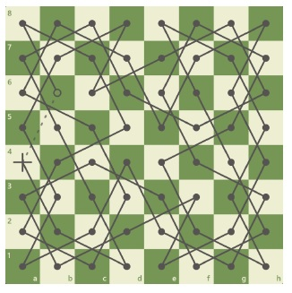

# Knight's Tour Task - Reinforcement Learning
The Knight's Tour task involves moving a knight across a chessboard so that it visits each position on the 8x8 board once and only once. 
The knight moves in an L shape.

I used Q-learning to solve this problem as part of a mini-project at the Imbizo 2022 summer school in Cape Town.

